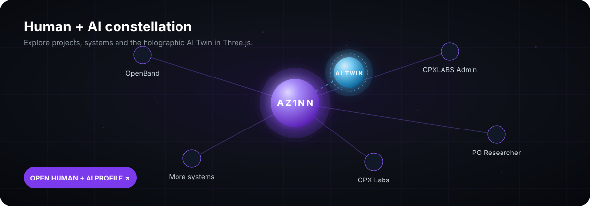

# Alan · `az1nn`

### Human engineering. Amplified by AI.

**Full Stack Engineer · AI/LLM · Product Engineering**

I build reliable software, intelligent systems and product experiences — from full-stack applications to AI workflows, automation and developer tooling.

---

## AI Twin

> **Same mindset. More compute.**

My **AI Twin** is a digital extension of my engineering process — not a replacement for it. It represents the loop I use to turn ideas into working systems faster and with more depth:

`Research` → `Architecture` → `Documentation` → `Automation` → `Code` → `Iteration`

The human side provides judgment, context, taste and responsibility. The twin amplifies exploration, synthesis and execution.

Inside the interactive profile, the Twin has explicit operating states — **Idle**, **Thinking** and **Building** — plus two complementary interfaces. The V0.3 local graph console executes explicit commands against the scene; V0.4 adds a graph-grounded conversational surface that answers natural-language questions using the public project graph and recent public GitHub activity.

The conversational Twin remains intentionally local-first and read-only. It does not embed an API key or pretend that the static GitHub Pages client is a privileged remote LLM. Unsupported questions fail closed instead of inventing private context or capabilities.

[**Open the living Human + AI graph ↗**](https://az1nn.github.io/az1nn/)

---

## Engineering focus

`React` · `Vite` · `TypeScript` · `Node.js` · `Python` · `FastAPI` · `.NET` · `LLMs` · `RAG` · `Agents` · `Docker` · `Kubernetes` · `AWS` · `Neo4j` · `Graph Engineering` · `Spec-Driven Development`

## Selected systems

| Project | What it explores |
| --- | --- |
| [OpenBand](https://github.com/az1nn/openband) | Music creation, immersive product UX and creative tooling |
| [CPXLABS Admin](https://github.com/az1nn/cpxlabs-admin) | Enterprise React/Vite architecture, Spec Kit and Engineering Graph |
| [MyHub](https://github.com/az1nn/myhub) | Spec-driven application foundation with graph-oriented engineering workflows |
| [PG Researcher](https://github.com/az1nn/pg-researcher) | Research workflows, structured knowledge and AI-assisted publishing |
| [Zapizapi](https://github.com/az1nn/zapizapi) | Message intake, automation and AI-assisted triage |

## Commit topology

  

## Living engineering graph

The interactive profile is data-driven from a single profile configuration. Projects have explicit graph relationships, recent public GitHub events become a live visual activity ring, and a compact technical timeline explains the progression from **building** to **systemizing**, **augmenting** and **graphing** the engineering process.

V0.4 makes that graph conversational. The **Ask AI Twin** interface can answer questions such as “What are you building now?”, “How are CPXLABS Admin and MyHub related?” or “Tell me about OpenBand”, expose its grounding evidence and offer allowlisted actions to focus projects, open public repositories or move into graph/activity/timeline views.

The underlying V0.3 console remains available with commands such as `projects`, `relations`, `activity`, `timeline`, `focus openband`, `open myhub` and `state building`.

  Orbit the scene · inspect relations · enter Project Focus · watch public activity · ask the AI Twin.

## Current direction

I am especially interested in **LLM application engineering, RAG, agent orchestration, spec-driven development, engineering graphs, developer tooling and interactive product experiences**.

The principle behind the work is simple: **software should create leverage**. AI matters when it strengthens clear architecture, practical automation and products that work in the real world.

`BUILD` · `SYSTEMIZE` · `AUGMENT` · `GRAPH`

